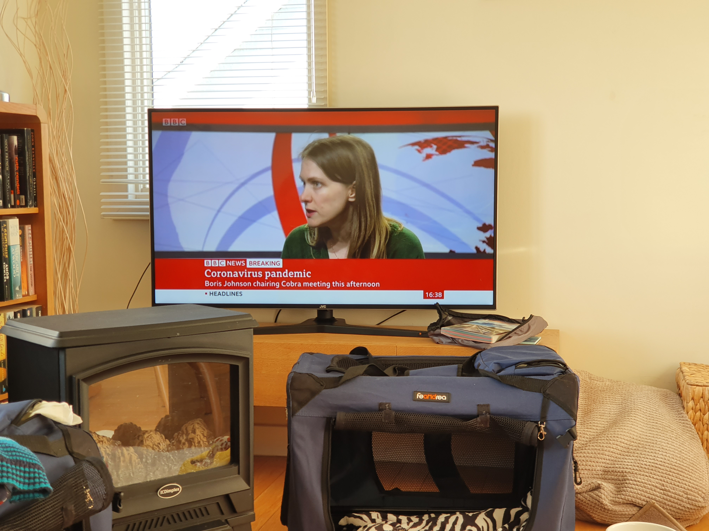
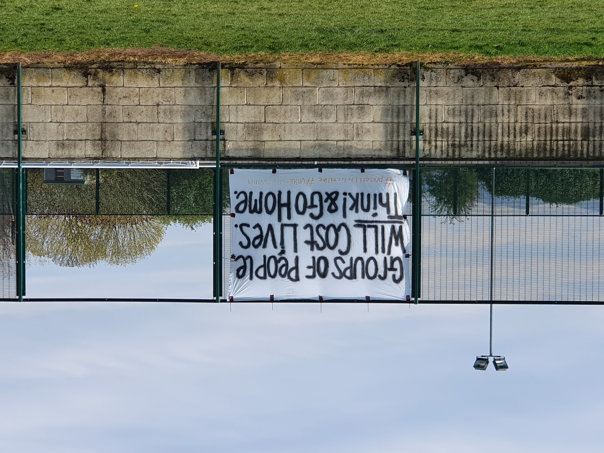

Like many of you, I've had a lot more time to pause and think about the present lately. Life has changed quite dramatically in such a short period of time.

Between 20th January and March 17th 2020 I had binged on travel - visiting Scotland, Wales, both parts of Ireland, Cornwall and Germany. Just one month on, we couldn't leave our homes without risking arrest.

It was clear that there were problems before the World shut down. I only remember the News beginning to  report about an illness in China in late January 2019.

Just before I travelled to Germany for work there were rumours of someone having Coronavirus locally, and whilst in Munich there were concerns of cases in my colleagues communities. It was concerning, especially moving through the airport and seeing people wearing face masks as that's something that was not a usual sight at that point in time.

I also witnessed what I would consider to be racism. People throughout the airport & streets would take obvious paths to avoid Asian people. At the start of February no-one really had an understanding that someone could be asymptomatic as there was too much unknown. The condition didn't even have an [official name](https://www.bbc.co.uk/news/world-asia-china-51466362) at that time. 

I assume the only reason for people distancing themselves was due to an adverse reaction to the news and stereotyping an entire group of people by their appearance.

Even with my own concerns, I wasn't really paying it too much attention. In my lifetime I've already lived through SARS, MERS, Swine Flu, Bird Flu & ebola outbreaks. They always (thankfully) appeared so distant.

Things started to change in late February when I travelled to Ireland with dad. By this time COVID-19 had ripped through Europe and had arrived in the UK. People had started panic buying hand santizer and (weirdly) toilet paper. It felt very surreal and became the butt of dark jokes between friends.

We travelled via ferry between Holyhead (Wales) and Ireland. I was concerned of being around groups at this point and kept an arms length from others. Whilst in Mullaghmore there was the first reported case of a person that had travelled between Dublin and Northern Ireland and others that I spoke to were getting anxious.

On the 11th March, COVID-19 was declared a pandemic and on the 13th I was travelling to Cornwall to celebrate my birthday with Amy and the dogs. Prior to leaving home, we discussed eating at our accomodation instead of venturing out for meals. We had taken some supplies with us just in case, which turned out to be the right decision as panic buying had started and everyday food was in short supply.

News was bad, reporting constantly on the infection rate / kill count and on my birthday the [UK Government started broadcasting the first daily update](https://www.bbc.co.uk/news/uk-51901818) to keep everyone informed.

Being Winter and in Gwithian it is generally pretty quiet but on the 17th March it was relatively busy. Lots of holiday plans had been cancelled due to travel bans that were now starting to be enforced and it seemed like everyone had descended to our location instead. It was a beautiful day though, really sunny and the waves were rolling.

I work in the travel industry and was aware of the impending downturn that was coming due to the [travel restrictions](https://en.wikipedia.org/wiki/Travel_restrictions_related_to_the_COVID-19_pandemic) being enforced. [My employer](https://holidayextras.co.uk) is great for transparency and kept us looped in to developments but with business waning they had to start offering some radical options. Payment holidays, reduced working hours or a sabbatical of between 3 and 6 months, all with the option to find non-competing work elsewhere to help cover the shortfall.

I had volunteered to take a 6 month sabbatical thinking that I could try and find some contracting work elsewhere, but of the leads I had chased the opportunity dried up pretty fast. Employment seemed to cease and companies seemed to be preparing to lockdown and hibernate.

As it turned out the UK Government really stepped up (for me at least) and offered a new route - [furlough](https://www.gov.uk/government/collections/financial-support-for-businesses-during-coronavirus-covid-19). Between March and May (later extended to June), they offered to cover many PAYE employees up to 80% of their salary, capped at £2500. This meant my employer didn't need to cover the cost of my salary and I didn't need to worry about complete loss of income.

On the day of the announcement I remember feeling the anxiety leaving my body as if it was lots of bad energy trapped that had found a route out. I actually cried a little as I was relieved that my family that depends on my wage wouldn't be thrown into turmoil.

My German colleagues also had a similar deal with the Kurzarbeit. It's not quite the same as they continue working reduced hours and their Government pay the shortfall, whilst in the UK the requirement is for the employee not to work for the employer.

Unforuntately I still lost work friends through these changes (though thankfully not due to the illness itself). Ahmed had only been in the company for just under 3 months and so his contract was released and the entire Bulgarian team who are sub-contracted, including my direct work buddies of about 2 years Emil & Tsvetko, were made unemployed.

The whole thing was unavoidable, my employer was hemorrhaging money and needed to stem it. I had grown close to these people, especially Emil, and the whole thing left me depressed when I heard the news. Fortunately I've been able to remain in touch and Emil and Tsvetko have both been able to secure other employment. It hurts to think that we won't be chatting everyday at work though.

My usual work schedule is Monday-Thursday and I work fully remote. I've been doing this for many years so I'm somewhat accustomed to being away from people. However, on the 23rd March my schedule changed to 50% reduced hours, which was Monday & Tuesday only and from April 1st it was reduced further to 0%.

I'm writing this post on the 6th May, having spent over a month adapting to the new schedule and having very little contact with others. I haven't seen my mum, dad or sister since February, I haven't seen my friends since last year.

Infrequently I'll log back into my work systems to check on messages people have left across various channels and to say hi to my German colleagues that are still working part-time. Later today I have a Google Meet with the wider web team that I intend to attend.

But mostly I keep myself busy with ongoing projects inside and outside of the house. I'll write about those in a later post as they're significant in their own way.

Amy or I go shopping once every 1 or 2 weeks. It's very stressful. Many people have no consideration for the recommended 2 meter distance guidelines and are happy to rub shoulders with you down the aisles. 

There's no way to avoid these people as supermarkets are often busy. If you get there too early you won't be allowed in due to (rightfully) key workers and vulnerable people having priority for an hour. If you arrive too late then you'll queue to get in the doors. Payment is made either via self-serving checkouts or by a cashier shielded behind a giant persplex screen.

When one of us returns home, the other puts the shower on for the "shopper" and cleans the interior of the car down. The shopper drops the bags into a [staging area at home to minimise future risk](https://www.healthline.com/health/how-long-does-coronavirus-last-on-surfaces#different-surfaces), strips and their clothes go straight into the washing machine, jumps in the shower and then continues as normal. Perhaps this seems excessive to others but we don't want to become of the statistics (as of yesterday, the UK has a higher death rate than Italy and just short of Spain, the two worst hit countries in Europe)

I try to exercise (1-2x run a week or some weight lifting in the garage) but I'm struggling to find the motivation, I'm sure its associated to ongoing stress caused by job uncertainty. I know that life will resume one day but I'm pessimistic about my employers ability to recover in time. The chancellor has made it clear that [furlough is unsustainable](https://www.dailymail.co.uk/news/article-8289457/Government-furlough-cash-reduced-60-cent-wages.html) as it's currently supporting 6.3 million workers, about £8 billion a month. It makes me sad to write this, I truely love the company I work for and really don't want to make a change.

Travel was one of the first industries to be hit (hard) and will be one of the last to recover. It's very unlikely to recover exactly as it was before because people need to earn money and time before they can use it, and that's not considering the [environmental benefit we've seen by reducing movement](https://www.carbonbrief.org/analysis-coronavirus-set-to-cause-largest-ever-annual-fall-in-co2-emissions). It's difficult to see how there could be a job to return to.

To make the situation worse, economies are sinking and one of the World's major currencies, the USD, is in [significant trouble](https://twitter.com/business/status/1252547142612406272). It isn't the best backdrop for finding new employment and I'm left feeling vulnerable. I appreciate that may sound crass considering there are far more vulnerable people in this world, I'm just trying to express how significant this is inside my tiny bubble.

I have observed how some businesses are fairing ok. Health and education appear to be doing well, and other less obvious businesses such as ink-printing firms are also making profits during the pandemic, but I do wonder how much fallout we have witnessed at this point in time. If business across the board doesn't recover soon and the furlough ends, it won't be long until there are secondary casulties such as the aforementioned.

On a positive note, news lately is focusing more on alleviating the rules of lockdowns across the World, so hopefully we'll see some sort of return to normality "soon" and there are [medical trials trying to find a vaccine](https://www.theguardian.com/world/2020/apr/17/world-biggest-drug-trial-covid-19-uk). These could ultimately lead to much wider benefits as COVID-19 is part of the same group of viruses as the common cold - goodbye man-flu!

Fortunately, no-one from my immediate circle has had their health affected by the virus. This is the ultimate bit of good news and everything else in this post would pale in comparison if that should change. I've lost friends and family for various reasons throughout my life, I know how painful it can be and I feel bad for the people that are dealing with this right now.

I'm unbelievably grateful for our health workers, our delivery workers, the supermarket assistants, the cleaners,  the support from the UK Government and everyone that isn't mentioned but is playing a key role in this mess. 

My mum is a cleaner at a kids school and my aunty cleans the QE hospital in Birmingam. I've always felt their job was overlooked but they make me proud, especially proud in current times as I imagine it can be quite terrifying for key workers to risk their health to make others lives easier or better.

> "It is said that the darkest hour of the night comes just before the dawn."\
> Thomas Fuller